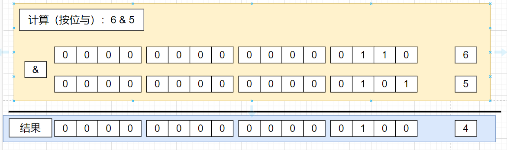

# 1.表达式
## 1.1 Scanner输入流的介绍

1. 导包
```java
improt java.util.Scanner
```
2. 创建Scanner对象【new】

3. 获取用户输入的数据【需要变量接受】

可以通过以下方法接受用户从键盘上输入的数据：
| 方法名称                 | 说明                           |
|----------------------|------------------------------|
| String next( )       | 获得一个字符串                      |
| String nextLine( )   | 获得一个字符串                      |
| int nextInt( )       | 获得一个整数                       |
| double nextDouble( ) | 获得一个双精度浮点数                   |
| boolean hasNext( )   | 判断是否有数据输入，有则返回true，否则返回false |

> 重要提示：关于next方法和nextLine()方法的区别：

- next()方法:一定要读取到有效字符后才可以结束输入，也就是如果一旦读取到空格之后就立即结束输入，空格之后的数据就不会被读取到。next()方法无法获取带有空格的方法，**会忽略空格**。
- nextLine()方法：是以回车键为结束符，也就是说nextLine()方法会返回输入回车键之前的所有字符，**不会忽略空格**。
> 建议：每次使用完流之后，建议使用input.close()关闭输入流。
## 1.2 常用运算符
Java中的运算符包括赋值运算符、算术运算符、关系运算符、逻辑运算符、位运算符、条件运算符等。
| 优先级 | 运算符           | 结合性  |    
|-----|---------------|------|
| 1   | ( ) [ ]       | 从左向右 |      
| 2   | ！~ ++ --      | 从右向左 |      
| 3   | *   /    %    | 从左向右 |      
| 4   | +    -        | 从左向右 |      
| 5   | >>   <<   >>> | 从左向右 |
| 6   | <  <=  >  >=   instanceof      | 从左向右 |      
| 7   | ==    !=      | 从左向右 |      
| 8   | &             | 从左向右 |      
| 9   | ^             | 从左向右 |      
| 10   | \|             | 从左向右 |
| 11   |&&               | 从左向右 |
| 12   |\|\|              | 从左向右 |
| 13   |？ ：               | 从右向左 |
| 14   |= += -= *= /= %= &= \|= ^= ~= <<= >>= >>>=               | 从右向左 |
> 赋值运算符具有最低的优先级，其次是条件运算符。
> 使用（）具有最高优先级；其次是单目运算符，包括！~ ++ 和--

> **单目运算符 > 算术运算符 > 位移运算符 > 关系运算符 > 逻辑运算符 > 三目运算符 > 赋值运算符**。

| && | 短路与 | 如果左边为false，右边表达式不会计算，相当于短路 |  
|----|-----|----------------------------|
| \|\| | 短路或 | 如果左边为true，右边表达式不会计算 |

### 附加逻辑运算符的短路与、短路或
1. 这里是列表文本
# 2.位运算符
1. 原码
- 最高位表示符号位，其余位表示该数的二进制的绝对值。
2. 反码
- 正数的反码与原码相同，而负数的反码是其原码除符号位外，按位取反的结果。
3. 补码
- 正数的补码等于其原码，而负数的补码等于其反码加1


> 提示：
> 
> **左移公式：`m << n = m*2^n`**
> 
> **右移公式：`m >> n = m/2^n`**

## 2.1 位运算的案例
1. 位运算，数值的二进制表示来进行运算，
运算通过补码来计算
- 例如正数的与运算

- 正数的或运算

- 正数的异或运算

- 非运算

- 左移


