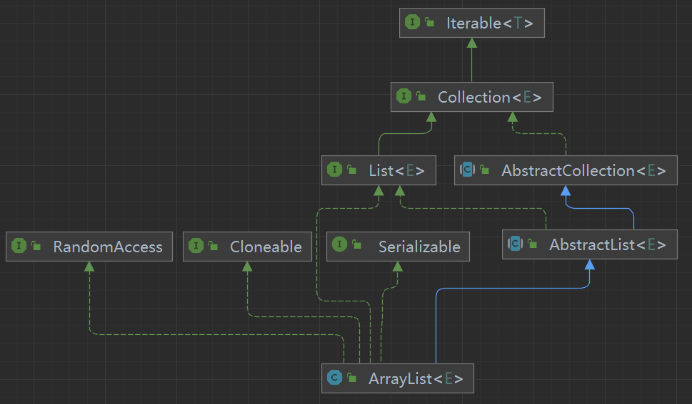

# 1、List，Set，Queue，Map四者的区别

Java 集合， 也叫作容器，主要是由两大接口派生而来：一个是 Collection 接口，主要用于存放单一元素；另一个是 Map 接口，主要用于存放键值对。对于Collection 接口，下面又有三个主要的子接口： List 、 Set 和 Queue

# 集合底层数据结构梳理
- List, Set, Queue, Map四者都是Collection 接口的子接口，都可以使用for-each 循环语法遍历元素，其它的区别见图上所示。
- 关于四者的实现类之间的区别
- List接口
    - ArrayList：Object[]数组
    - Vector：Object[]数组
    - LinkedList：双向链表
- Set接口
    - HashSet（无序，唯一）：底层使用HashMap存储数据
    - LinkedHashSet：LinkedHashSet 是 HashSet 的子类，并且其内部是通过 LinkedHashMap 来实现的。
    - TreeSet (有序，唯一): 红黑树(自平衡的排序二叉树)
- Queue接口
    - Deque接口：双端队列
    - PriorityQueue : Object[] 数组
    - ArrayDeque : Object[] 数组
- Map接口
    - HashMap：数组 + 链表|红黑树。
        - 添加元素时，如果当前数组的长度小于 64，那么会选择先进行数组扩容。
        - 如果数组长度达到64时，数组不在扩容，而是转换数组 + 链表存储元素。
        - 当链表长度大于阈值（默认为 8）时，将链表转化为红黑树，以减少搜索时间。
    - LinkedHashMap：（双向链表） +（数组 + 链表|红黑树），其中的双向链表实现了LinkedHashMap 能顺序访问。
    - Hashtable ：数组+链表组成的
    - TreeMap ：红黑树（自平衡的排序二叉树）
注意：关于HashMap 和 Hashtable 的区别还需要详细介绍。

# 2、关于集合的的选用
我们主要根据集合的特点来选择合适的集合。比如：
- 需要根据键值获取到元素值时就选用 Map 接口下的集合
    - 需要排序时选择 TreeMap
    - 不需要排序时就选择 HashMap
    - 需要保证线程安全就选用 ConcurrentHashMap
- 只需要存放元素值时，就选择实现 Collection 接口的集合
    - 需要保证元素唯一时选择实现 Set 接口的集合比如 TreeSet 或 HashSet
    - 不需要保证元素唯一时选择实现 List 接口的集合比如 ArrayList 或 LinkedList
- 需要队列时就选择Queue接口下的集合
- 单端队列就选择PriorityQueue
- 双端队列就选ArrayDeque

# 2.1 为什么使用集合
- 当我们需要存储一组类型相同的数据时，数组是最常用且最基本的容器之一。但是，使用数组存储对象存在一些不足之处，因为在实际开发中，存储的数据类型多种多样且数量不确定。这时，Java 集合就派上用场了。
- 与数组相比，Java 集合提供了更灵活、更有效的方法来存储多个数据对象。Java集合框架中的各种集合类和接口可以存储不同类型和数量的对象，同时还具有多样化的操作方式。相较于数组，Java 集合的优势在于它们的大小可变、支持泛型、具有内建算法等。
- 总的来说，Java 集合提高了数据的存储和处理灵活性，可以更好地适应现代软件开发中多样化的数据需求，并支持高质量的代码编写

# 3、List接口

## 3.1 ArrayList 和 Array（数组）的区别？
ArrayList 内部基于动态数组实现，比 Array （静态数组） 使用起来更加灵活：
- ArrayList 会根据实际存储的元素动态地扩容或缩容，而 Array 被创建之后就不能改变它的长度了。
- ArrayList 允许你使用泛型来确保类型安全， Array 则不可以。
- ArrayList 中只能存储对象。对于基本类型数据，需要使用其对应的包装类（如 Integer、Double 等，不能是int，double等）。 Array 可以直接存储基本类型数据，也可以存储对象。
- ArrayList 支持插入、删除、遍历等常见操作，并且提供了丰富的 API 操作方法，比如 add() 、 remove() 等。 Array 只是一个固定长度的数组，只能按照下标访问其中的元素，不具备动态添加、删除元素的能力。
- ArrayList 创建时不需要指定大小，而 Array 创建时必须指定大小。

## 3.1  LinkedList 为什么不能实现RandomAccess 接口？
RandomAccess 是一个标记接口，用来表明实现该接口的类支持随机访问（即可以通过索引快速访问元素）。由于 LinkedList 底层数据结构是链表，内存地址不连续，只能通过指针移动来定位，不支持随机快速访问，所以不能实现RandomAccess 接口。
# 4.ArrayList 与 LinkedList 区别?

根据以上的继承结构图理解：
- 是否保证线程安全： ArrayList 和 LinkedList 都是不同步的，也就是不保证线程安全；
- 底层数据结构： ArrayList 底层使用的是 Object 数组； LinkedList 底层使用的是 双向链表 数据结构
- 插入和删除是否受元素位置的影响：
    - ArrayList 采用数组存储，所以插入和删除元素的时间复杂度受元素位置的影响。 比如：执行 add(E e) 方法的时候， ArrayList 会默认将指定的元素追加到末尾，这种情况时间复杂度就是 O(1)。但是如果要在指定位置 i插入和删除元素的话 add(int index, E element) ，时间复杂度就为O(n)。因为在进行上述操作的时候集合中第 i 和第 i 个元素之后的(n-i)个元素都要执行向后移一位的操作。
    - LinkedList 采用链表存储，所以在头尾插入或者删除元素不受元素位置的影响（ add(E e) 、 addFirst(E e) 、 addLast(E e) 、removeFirst() 、 removeLast() ），时间复杂度为 O(1)，如果是要在指
定位置 i 插入和删除元素的话（ add(int index, E element) ，remove(Object o) , remove(int index) ）， 时间复杂度为 O(n) ，因为需要先移动到指定位置再插入和删除。
- 是否支持快速随机访问： LinkedList 不支持高效的随机元素访问，而ArrayList （实现了 RandomAccess 接口） 支持。快速随机访问就是通过元素的下标快速获取元素对象(对应于 get(int index) 方法)。
- 内存空间占用： ArrayList 的空间浪费主要体现在 list 列表的结尾会预留一定的容量空间，而 LinkedList 的空间花费则体现在它的每一个元素都需要消耗比ArrayList 更多的空间（因为要存放直接后继和直接前驱以及数据）。

 **另外，不要下意识地认为 LinkedList 作为链表就最适合元素增删的场景。我在上
面也说了， LinkedList 仅仅在头尾插入或者删除元素的时候时间复杂度近似
O(1)，其他情况增删元素的平均时间复杂度都是 O(n) 。** 